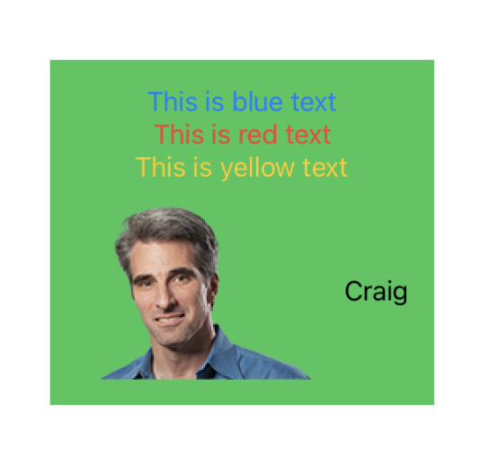
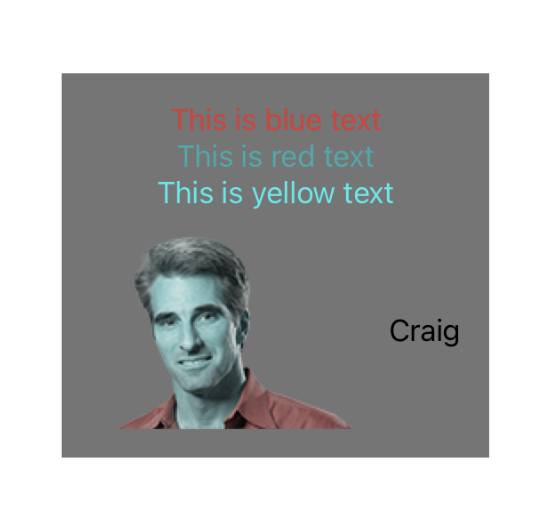

# Chris's SwiftUI Preview Color Blindness

A SwiftUI Preview View Modifier to simulate different types of Colour Blindness

## Overview

```
import PreviewColorBlindness

#if DEBUG
struct ExampleSwiftUIView_Previews: PreviewProvider {
  static var previews: some View {
    Group {
      ExampleSwiftUIView()
        .previewColorBlindness(type: .protanope)
    }
  }
}
#endif

```

| Before | After |
|--------|-------|
|

